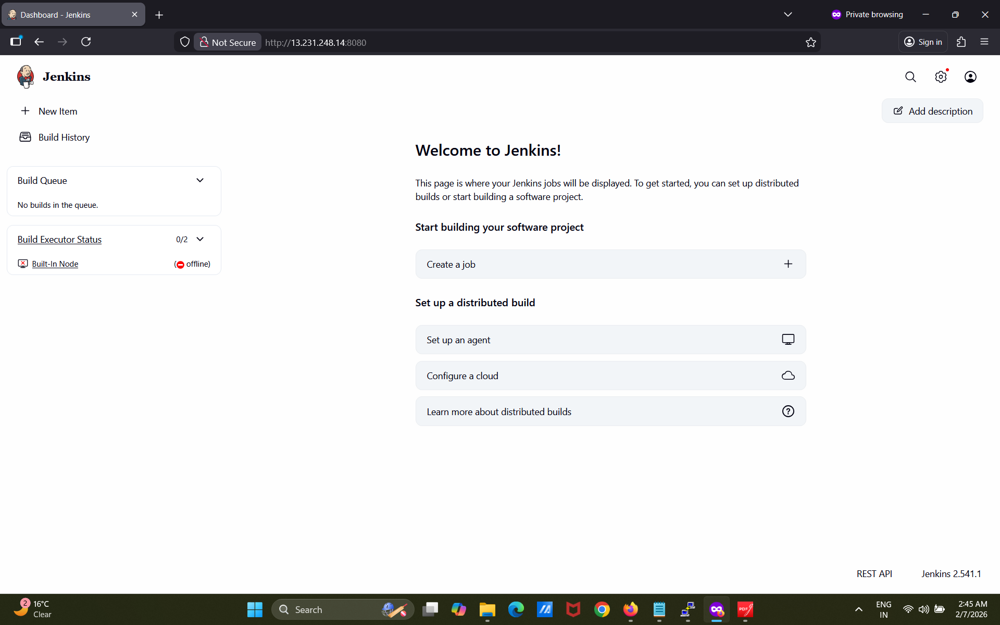

# 🚀 Automated CI/CD Pipeline for Web Server Deployment


## 🏗️ System Architecture

```text
Developer
   |
   |  (git push)
   v
GitHub Repository
   |
   |  (Webhook Trigger)
   v
Jenkins CI/CD Pipeline
   |
   |  (Build Docker Image)
   v
Docker Container
   |
   |  (Deploy)
   v
AWS EC2 Web Server (Live Website)

## 📸 Project Screenshots

### 🔹 AWS EC2 Instance Setup


### 🔹 Jenkins Installation and Homepage


### 🔹 Jenkins Pipeline Execution


### 🔹 CI/CD website before Automation


### 🔹 GitHub Webhook Configuration


### 🔹 Live Website Deployment

