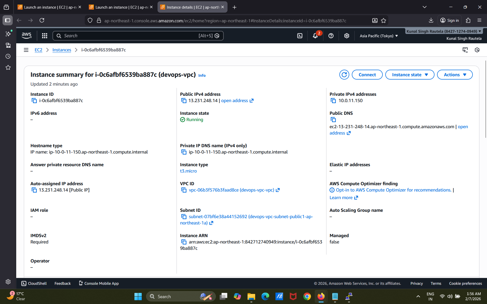
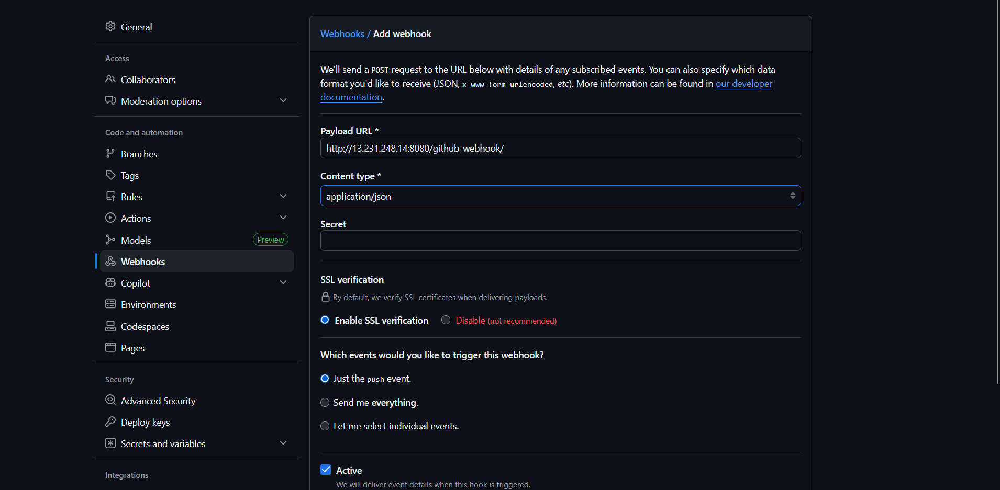
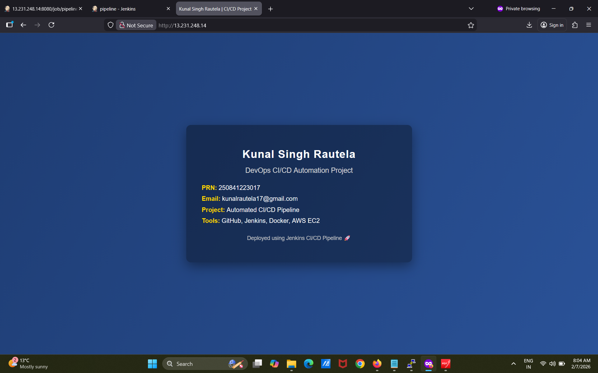

# 🚀 Automated CI/CD Pipeline for Web Server Deployment


## 📖 Introduction

In modern software development, manual deployment processes are time-consuming, error-prone, and difficult to scale. DevOps practices aim to solve these challenges by automating the build, test, and deployment lifecycle using Continuous Integration and Continuous Deployment (CI/CD).

This project focuses on implementing a real-world CI/CD pipeline using Jenkins, Docker, and AWS EC2. The goal is to automate application deployment such that any change pushed to the GitHub repository is automatically built and deployed without manual intervention.

## ❗ Problem Statement

Traditional application deployment involves multiple manual steps such as copying files, configuring servers, and restarting services. These manual processes can lead to configuration inconsistencies, deployment delays, and human errors.

The challenge is to design a system that:
- Eliminates manual deployment steps
- Ensures consistent application environments
- Automatically deploys applications on every code change
- Scales easily with minimal effort

## 🎯 Objectives of the Project

- To understand and implement CI/CD concepts
- To automate application deployment using Jenkins
- To containerize applications using Docker
- To deploy applications on AWS EC2
- To integrate GitHub webhooks for automatic pipeline execution
- To gain hands-on experience with real DevOps tools

## 🛠️ Tools & Technologies (Theory)

### 🔹 Git & GitHub
Git is a distributed version control system used to track changes in source code. GitHub provides a centralized platform for hosting Git repositories and enables collaboration, versioning, and webhook-based automation.

### 🔹 Jenkins
Jenkins is an open-source automation server used to implement CI/CD pipelines. It supports pipeline-as-code using Jenkinsfile and integrates seamlessly with GitHub to automate build and deployment workflows.

### 🔹 Docker
Docker is a containerization platform that packages applications and their dependencies into lightweight containers. Containers ensure consistency across different environments and simplify deployment.

### 🔹 AWS EC2
Amazon Elastic Compute Cloud (EC2) provides scalable virtual servers in the cloud. In this project, EC2 is used as the hosting platform for Jenkins and the deployed web application.

## 🔄 CI/CD Pipeline Explanation

1. The developer pushes updated code to the GitHub repository.
2. GitHub webhook sends a trigger to Jenkins.
3. Jenkins pulls the latest code from the repository.
4. Jenkins builds a Docker image using the Dockerfile.
5. Existing Docker containers are stopped and removed.
6. A new container is launched with the updated application.
7. The updated website becomes live on the AWS EC2 server.

This automated pipeline ensures faster deployment, reduced errors, and improved reliability.

## 🏗️ System Architecture

```text
Developer
   |
   |  (git push)
   v
GitHub Repository
   |
   |  (Webhook Trigger)
   v
Jenkins CI/CD Pipeline
   |
   |  (Build Docker Image)
   v
Docker Container
   |
   |  (Deploy)
   v
AWS EC2 Web Server (Live Website)
```

## 🧪 Implementation Details

- Jenkins is configured as a Pipeline job using Pipeline as Code.
- Docker is installed on the same EC2 instance to build and run containers.
- The application is served using Nginx inside a Docker container.
- Jenkinsfile defines all pipeline stages for build and deployment.
- GitHub webhook eliminates the need for manual build triggers.

## ✅ Advantages of the System

- Fully automated deployment process
- Faster release cycles
- Reduced manual errors
- Consistent deployment environments
- Easy scalability and maintenance
- Industry-standard DevOps workflow

## ⚠️ Limitations

- Basic security configuration (no HTTPS)
- Single-server deployment
- No automated testing stage included
- Requires EC2 instance to be running for access

  ## 🚀 Future Enhancements

- Add automated testing stage in the pipeline
- Implement HTTPS using Nginx and SSL certificates
- Use Docker Compose or Kubernetes for scalability
- Add monitoring using Prometheus and Grafana
- Implement role-based access control in Jenkins

## 📸 Project Screenshots

### 🔹 AWS EC2 Instance Setup


### 🔹 Jenkins Installation and Homepage


### 🔹 Jenkins Pipeline Execution


### 🔹 CI/CD Website Before Automation


### 🔹 GitHub Webhook Configuration


### 🔹 Live Website Deployment


## 🏁 Conclusion

This project successfully demonstrates the practical implementation of CI/CD using Jenkins, Docker, and AWS EC2. By automating the deployment process, the system improves efficiency, reliability, and consistency. The project provides a strong foundation for understanding DevOps practices and prepares for real-world industry scenarios.


